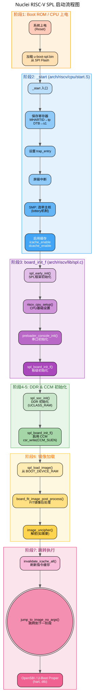
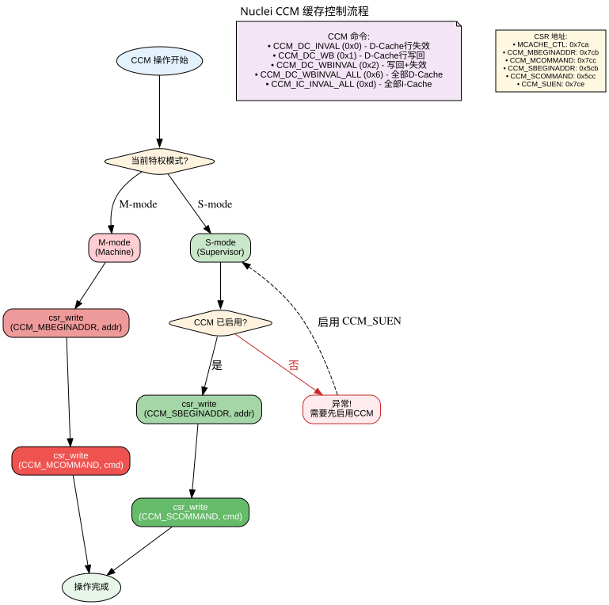
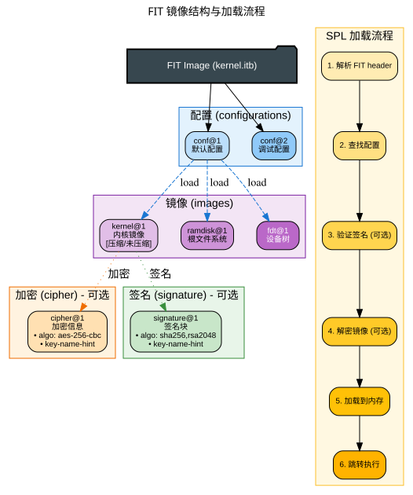
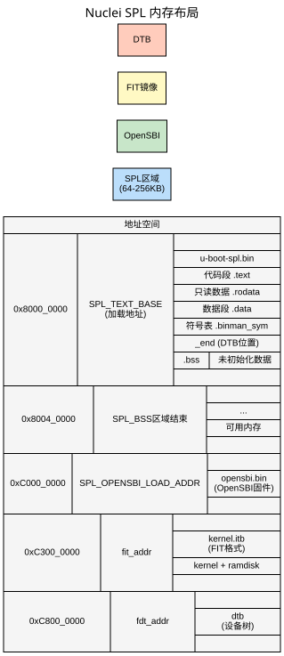

# Nuclei 平台 U-Boot SPL 工作机制详解

## 一、SPL 概述

**SPL（Secondary Program Loader）** 是 U-Boot 的"轻量级先锋队"。由于嵌入式系统上电后可用内存有限，Boot ROM 只能加载一个很小的镜像（通常几十KB），这个镜像就是 SPL。

### SPL 的核心使命

1. **初始化 DDR 内存** — 让系统有足够 RAM
2. **启用缓存** — 提升性能
3. **加载主 U-Boot** — 从 Flash/SD 卡加载完整的 U-Boot
4. **跳转到下一阶段** — 将控制权交给主 U-Boot

---

## 二、Nuclei SPL 的核心代码位置

```
arch/riscv/cpu/nuclei/
├── spl.c          # SoC 层 SPL 初始化 (DDR 初始化)
├── cache.c        # CCM 缓存控制 (I/D-Cache 管理)
├── dram.c         # DRAM 初始化 (U-Boot Proper 阶段)
├── cpu.c          # CPU 通用代码
├── Kconfig        # Nuclei SPL 配置选项
└── Makefile       # SPL/U-Boot 分别编译规则

board/nuclei/generic/
├── spl.c          # 板级 SPL 业务逻辑 (CCM 启用、FIT 解密)
├── generic.c      # 板级通用代码
├── Kconfig        # 板级配置 (加载地址、启动设备)
└── Makefile       # 条件编译规则

arch/riscv/lib/
└── spl.c          # RISC-V 通用 SPL 入口 (board_init_f)

arch/riscv/cpu/
├── start.S        # 统一入口点 (_start)
└── u-boot-spl.lds # SPL 链接脚本

include/configs/
└── nuclei-generic.h  # 板级配置头文件

include/asm/arch-nuclei/
└── csr.h          # Nuclei 特有 CSR 定义
```

---

## 三、SPL 启动流程详解



```
┌─────────────────────────────────────────────────────────────────────┐
│ 阶段 1: Boot ROM / CPU 上电                                          │
│ └── 从固定地址加载 u-boot-spl.bin (通常在 SPI Flash 偏移 0)          │
└──────────────────────────────┬──────────────────────────────────────┘
                               │
┌──────────────────────────────▼──────────────────────────────────────┐
│ 阶段 2: _start (arch/riscv/cpu/start.S)                              │
│ ├── 读取 CSR_MHARTID → tp (hart ID)                                 │
│ ├── 保存 DTB 指针 → s1 (a1 寄存器传入)                               │
│ ├── 设置 trap_entry (异常入口)                                      │
│ ├── 屏蔽所有中断                                                    │
│ ├── SMP: 多核选举主核 (lottery 机制)                                 │
│ └── 启用缓存 (icache_enable / dcache_enable)                         │
└──────────────────────────────┬──────────────────────────────────────┘
                               │
┌──────────────────────────────▼──────────────────────────────────────┐
│ 阶段 3: board_init_f (arch/riscv/lib/spl.c)                          │
│ ├── spl_early_init()          # SPL 框架初始化                       │
│ ├── riscv_cpu_setup()         # CPU 基础设置                         │
│ ├── preloader_console_init()  # 串口控制台初始化                      │
│ └── spl_board_init_f()        # 板级初始化 (重点！)                   │
└──────────────────────────────┬──────────────────────────────────────┘
                               │
┌──────────────────────────────▼──────────────────────────────────────┐
│ 阶段 4: spl_soc_init (arch/riscv/cpu/nuclei/spl.c)                   │
│ └── uclass_get_device(UCLASS_RAM, 0, &dev)                          │
│     └── DDR 初始化 (通过 Driver Model 框架)                          │
└──────────────────────────────┬──────────────────────────────────────┘
                               │
┌──────────────────────────────▼──────────────────────────────────────┐
│ 阶段 5: spl_board_init_f (board/nuclei/generic/spl.c)                │
│ └── csr_write(CCM_SUEN, CCM_SEN)                                    │
│     └── 启用 S-mode CCM 缓存操作 (Nuclei 特有！)                     │
└──────────────────────────────┬──────────────────────────────────────┘
                               │
┌──────────────────────────────▼──────────────────────────────────────┐
│ 阶段 6: spl_load_image                                               │
│ ├── 从 BOOT_DEVICE_RAM 读取 FIT 镜像                                │
│ ├── board_fit_image_post_process()                                  │
│ │   └── image_uncipher()  # FIT 镜像解密 (安全启动)                  │
│ └── 将镜像加载到内存 (如 0xc3000000)                                 │
└──────────────────────────────┬──────────────────────────────────────┘
                               │
┌──────────────────────────────▼──────────────────────────────────────┐
│ 阶段 7: jump_to_image_no_args                                        │
│ ├── invalidate_icache_all()  # 刷新指令缓存                         │
│ └── image_entry(gd->arch.boot_hart, fdt_blob)                       │
│     └── 跳转到下一阶段 (OpenSBI 或 U-Boot Proper)                    │
└─────────────────────────────────────────────────────────────────────┘
```

---

## 四、关键代码深度解析

### 4.1 SoC 层初始化 — `arch/riscv/cpu/nuclei/spl.c`

```c
int spl_soc_init(void)
{
    int ret;
    struct udevice *dev;

    /* DDR 初始化 - 通过 Driver Model */
    ret = uclass_get_device(UCLASS_RAM, 0, &dev);
    if (ret) {
        debug("DRAM init failed: %d\n", ret);
        return ret;
    }
    return 0;
}
```

**业务逻辑：**
- 使用 U-Boot 的 **Driver Model (DM)** 框架初始化 DDR
- `UCLASS_RAM` 是 RAM 驱动的统一接口
- 这是 SPL 最重要的工作：**让系统有可用内存**

### 4.2 板级初始化 — `board/nuclei/generic/spl.c`

```c
int spl_board_init_f(void)
{
    // Nuclei 特有: 启用 S-mode CCM 缓存操作
    #define CCM_SUEN    0x7CE       // CSR: CCM S-mode 启用
    #define CCM_SEN     0x2020202   // 魔法值 (具体含义见手册)

    csr_write(CCM_SUEN, CCM_SEN);   // 写 CSR 启用 CCM
    return 0;
}
```

**业务逻辑：**
- Nuclei 处理器特有的 **CCM (Cache Control and Management)** 机制
- 必须在 DDR 初始化**之后**执行
- 启用后，S-mode (Supervisor Mode) 才能操作缓存

### 4.3 缓存管理 — `arch/riscv/cpu/nuclei/cache.c`

```c
// CCM 命令枚举
typedef enum CCM_CMD {
    CCM_DC_INVAL = 0x0,           // D-Cache 行失效
    CCM_DC_WB = 0x1,              // D-Cache 行写回
    CCM_DC_WBINVAL = 0x2,         // 写回+失效
    CCM_DC_WBINVAL_ALL = 0x6,     // 全部 D-Cache 写回+失效
    CCM_IC_INVAL_ALL = 0xd        // 全部 I-Cache 失效
} CCM_CMD_Type;

void icache_enable(void)
{
    csr_set(CSR_MCACHE_CTL, CSR_MCACHE_ICACHE_EN
            | CSR_MCACHE_ICACHE_PF_EN | CSR_MCACHE_ICACHE_CANCLE_EN);
}

void dcache_enable(void)
{
    csr_set(CSR_MCACHE_CTL, CSR_MCACHE_DCACHE_EN);
}
```

**业务逻辑：**
- Nuclei 使用**自定义 CSR** 控制缓存，非标准 RISC-V 指令
- 缓存行大小：**64字节** (`SYS_CACHE_SHIFT_6`)
- CCM 操作通过 `csr_write(CSR_CCM_MCOMMAND, cmd)` 执行



### 4.4 FIT 镜像解密 — `board/nuclei/generic/spl.c`

```c
static int image_uncipher(const void *fit, int image_noffset,
                         void **data, size_t *size)
{
    // 1. 查找 cipher 子节点
    cipher_noffset = fdt_subnode_offset(fit, image_noffset,
                                        FIT_CIPHER_NODENAME);
    if (cipher_noffset < 0)
        return 0;  // 未加密，直接返回

    // 2. 解密数据
    ret = fit_image_decrypt_data(fit, image_noffset, cipher_noffset,
                                 *data, *size, &dst, &size_dst);

    // 3. 返回解密后的数据
    *data = dst;
    *size = size_dst;
    return 0;
}

// FIT 镜像加载后回调
void board_fit_image_post_process(const void *fit, int node,
                                  void **p_image, size_t *p_size)
{
    image_uncipher(fit, node, p_image, p_size);
}
```

**业务逻辑：**
- 支持 **安全启动**：FIT 镜像可以加密存储
- 自动检测是否包含 cipher 节点
- 透明解密，对上层逻辑无感知



### 4.5 启动设备选择

```c
u32 spl_boot_device(void)
{
    return BOOT_DEVICE_RAM;  // 从 RAM 启动
}
```

**可选值：**
- `BOOT_DEVICE_RAM` — RAM (当前配置)
- `BOOT_DEVICE_MMC` — SD/eMMC
- `BOOT_DEVICE_SPI` — SPI Flash
- `BOOT_DEVICE_NAND` — NAND Flash

### 4.6 设备树传递

```c
void *board_fdt_blob_setup(int *err)
{
    void *fdt_blob = (ulong *)&_end;  // DTB 在 BSS 结束处
    *err = 0;
    return fdt_blob;
}
```

**业务逻辑：**
- DTB (Device Tree Blob) 通常由 **OpenSBI** 或仿真器提供
- 放在 `_end` 符号处 (BSS 段结束)
- 通过 a1 寄存器传递给下一阶段

### 4.7 统一 SPL 入口 — `arch/riscv/lib/spl.c`

```c
__weak void board_init_f(ulong dummy)
{
    int ret;

    ret = spl_early_init();
    if (ret)
        panic("spl_early_init() failed: %d\n", ret);

    riscv_cpu_setup(NULL, NULL);

    preloader_console_init();

    ret = spl_board_init_f();
    if (ret)
        panic("spl_board_init_f() failed: %d\n", ret);
}

void __noreturn jump_to_image_no_args(struct spl_image_info *spl_image)
{
    typedef void __noreturn (*image_entry_riscv_t)(ulong hart, void *dtb);
    void *fdt_blob;

    fdt_blob = spl_image->fdt_addr;
    image_entry_riscv_t image_entry =
        (image_entry_riscv_t)spl_image->entry_point;
    invalidate_icache_all();

    image_entry(gd->arch.boot_hart, fdt_blob);
}
```

---

## 五、SPL 内存布局



```
0x8000_0000  ┌──────────────────────┐  ← SPL_TEXT_BASE (加载地址)
             │   u-boot-spl.bin     │     (64KB-256KB)
             │   代码段 .text       │
             │   只读数据 .rodata   │
             │   数据段 .data       │
             │   符号表 .binman_sym │
             │   _end (DTB 位置)    │
             ├──────────────────────┤
             │   .bss (未初始化)    │
             │   在 SPL_BSS 区域    │
0x8004_0000  ├──────────────────────┤
             │        ...           │
             │   (可用内存区域)     │
             │                      │
0xC000_0000  ┌──────────────────────┐  ← SPL_OPENSBI_LOAD_ADDR
             │   opensbi.bin        │     (OpenSBI 固件)
             │                      │
0xC300_0000  ┌──────────────────────┐  ← fit_addr (FIT 镜像)
             │   kernel.itb         │     (FIT 格式: kernel + ramdisk)
             │                      │
0xC800_0000  ┌──────────────────────┐  ← fdt_addr (设备树)
             │   dtb                │
             └──────────────────────┘
```

### 5.1 SPL 链接脚本 (`arch/riscv/cpu/u-boot-spl.lds`)

```lds
MEMORY {
    .spl_mem : ORIGIN = IMAGE_TEXT_BASE, LENGTH = IMAGE_MAX_SIZE
    .bss_mem : ORIGIN = CONFIG_SPL_BSS_START_ADDR,
               LENGTH = CONFIG_SPL_BSS_MAX_SIZE
}

OUTPUT_ARCH("riscv")
ENTRY(_start)

SECTIONS
{
    .text : {
        arch/riscv/cpu/start.o (.text)
        *(.text*)
    } > .spl_mem

    .rodata : { *(SORT_BY_ALIGNMENT(SORT_BY_NAME(.rodata*))) } > .spl_mem
    .data : { *(.data*) } > .spl_mem

    __u_boot_list : { KEEP(*(SORT(__u_boot_list*))); } > .spl_mem

    .binman_sym_table : {
        __binman_sym_start = .;
        KEEP(*(SORT(.binman_sym*)));
        __binman_sym_end = .;
    } > .spl_mem

    _end = .;
    _image_binary_end = .;

    .bss : {
        __bss_start = .;
        *(.bss*)
        __bss_end = .;
    } > .bss_mem
}
```

**特点：**
- 体积小 (64KB-256KB)
- 独立内存区
- 简化段结构
- 无重定位段 - 不需要运行时重定位

---

## 六、配置选项详解

### 6.1 默认配置 (`configs/nuclei_generic_defconfig`)

```bash
# 基础架构
CONFIG_RISCV=y
CONFIG_ARCH_RV64I=y              # 64位 RISC-V
CONFIG_RISCV_SMODE=y             # Supervisor Mode
CONFIG_CMODEL_MEDANY=y           # 代码模型: medium any

# Nuclei 平台
CONFIG_TARGET_NUCLEI_GENERIC_SOC=y

# 启动配置
CONFIG_FIT=y                     # 支持 FIT 镜像格式
CONFIG_SYS_LOAD_ADDR=0xA0200000  # 默认加载地址
CONFIG_CUSTOM_SYS_INIT_SP_ADDR=0xA0200000  # 初始化栈地址

# 外设支持
CONFIG_SPI_FLASH=y               # SPI Flash
CONFIG_MMC=y                     # SD/MMC
CONFIG_CMD_SF=y                  # SPI Flash 命令
CONFIG_CMD_MMC=y                 # MMC 命令
```

### 6.2 板级 Kconfig (`board/nuclei/generic/Kconfig`)

```bash
config SPL_TEXT_BASE
    default 0x80000000           # SPL 加载地址

config SPL_OPENSBI_LOAD_ADDR
    default 0xc0000000           # OpenSBI 地址

config BOARD_SPECIFIC_OPTIONS
    select NUCLEI_RISCV          # Nuclei RISC-V 支持
    select SUPPORT_SPL           # 支持 SPL
    imply SPL_OPENSBI            # OpenSBI 支持
    imply SPL_LOAD_FIT           # FIT 镜像支持
    imply SPL_RAM_SUPPORT        # RAM 支持
```

### 6.3 Nuclei 特有 Kconfig (`arch/riscv/cpu/nuclei/Kconfig`)

```bash
config NUCLEI_RISCV
    bool
    select ARCH_EARLY_INIT_R
    select SYS_CACHE_SHIFT_6      # 64B cache line
    imply CPU
    imply CPU_RISCV
    imply RISCV_TIMER if (RISCV_SMODE || SPL_RISCV_SMODE)
    imply RISCV_ACLINT if RISCV_MMODE
    imply SPL_RISCV_ACLINT if SPL_RISCV_MMODE
    imply CMD_CPU
    imply SPL_CPU
    imply SPL_OPENSBI
    imply SPL_LOAD_FIT
```

---

## 七、SPL vs U-Boot Proper 对比

| 特性 | SPL | U-Boot Proper |
|------|-----|---------------|
| **体积** | 64KB-256KB | 512KB-2MB |
| **功能** | DDR 初始化 + 加载 | 完整 Bootloader |
| **驱动** | 仅基本 (RAM/UART) | 完整驱动模型 |
| **命令** | 无 | 完整命令集 |
| **网络** | 通常无 | 有 |
| **重定位** | 无 (静态链接) | 有 (PIE) |
| **链接脚本** | `u-boot-spl.lds` | `u-boot.lds` |
| **代码文件** | `spl.c`, `cache.c` | `cpu.c`, `dram.c` |
| **运行模式** | M-mode (Machine) | S-mode (Supervisor) |

---

## 八、关键注意事项 ⚠️

### 8.1 CCM 启用顺序

```
正确: spl_soc_init() [DDR] → spl_board_init_f() [CCM]
错误: CCM 在 DDR 前启用 → 系统崩溃
```

### 8.2 不要启用 CONFIG_SPL_FRAMEWORK_BOARD_INIT_F

```c
// board/nuclei/generic/spl.c 明确警告:
// you should never select CONFIG_SPL_FRAMEWORK_BOARD_INIT_F in kconfig
```

Nuclei 使用**弱符号覆盖**，而非框架回调。

### 8.3 启动设备可配置

```c
// 当前从 RAM 启动，可改为:
return BOOT_DEVICE_MMC;   // SD 卡
return BOOT_DEVICE_SPI;   // SPI Flash
return BOOT_DEVICE_NAND;  // NAND Flash
```

### 8.4 双镜像机制

- `spl/u-boot-spl.bin` — SPL 镜像 (小)
- `u-boot.itb` — FIT 组合镜像 (包含 kernel + ramdisk)

### 8.5 条件编译规则

```makefile
# arch/riscv/cpu/nuclei/Makefile
ifeq ($(CONFIG_SPL_BUILD),y)
    obj-y += spl.o              # SPL 专用代码
else
    obj-y += cpu.o dram.o       # U-Boot Proper 代码
endif
obj-y += cache.o                # 两者共有
```

---

## 九、Nuclei 特有 CSR 说明

| CSR | 地址 | 用途 |
|-----|------|------|
| `MCACHE_CTL` | 0x7ca | 缓存控制 |
| `MMISC_CTL` | 0x7d0 | 杂项控制 |
| `CCM_MBEGINADDR` | 0x7cb | M-mode CCM 起始地址 |
| `CCM_MCOMMAND` | 0x7cc | M-mode CCM 命令 |
| `CCM_SBEGINADDR` | 0x5cb | S-mode CCM 起始地址 |
| `CCM_SCOMMAND` | 0x5cc | S-mode CCM 命令 |
| `CCM_SUEN` | 0x7ce | S-mode CCM 启用 |

### CCM 缓存命令

| 命令 | 值 | 说明 |
|------|-----|------|
| `CCM_DC_INVAL` | 0x0 | D-Cache 行失效 |
| `CCM_DC_WB` | 0x1 | D-Cache 行写回 |
| `CCM_DC_WBINVAL` | 0x2 | 写回+失效 |
| `CCM_DC_WBINVAL_ALL` | 0x6 | 全部 D-Cache 写回+失效 |
| `CCM_IC_INVAL_ALL` | 0xd | 全部 I-Cache 失效 |

---

## 十、总结

### Nuclei 平台的 SPL 核心工作

1. **DDR 初始化** — 通过 Driver Model 的 `UCLASS_RAM` 驱动
2. **CCM 启用** — Nuclei 特有，启用 S-mode 缓存操作 (`0x7CE` CSR)
3. **缓存管理** — 使用自定义 CCM CSR 控制 I/D-Cache
4. **FIT 镜像加载** — 支持加密镜像的安全启动
5. **跳转到下一阶段** — 通常是 OpenSBI → U-Boot Proper

### 启动流程记忆口诀

```
上电 → _start → 存寄存器 → 设陷阱 → 关中断 → 选主核 → 开缓存
     → board_init_f → 框架初始化 → CPU设置 → 串口初始化
     → spl_soc_init → DDR 初始化
     → spl_board_init_f → CCM 启用
     → spl_load_image → 加载 FIT 镜像 → 解密(可选)
     → jump_to_image_no_args → 跳转下一阶段
```

### SPL 就像建筑工地上的"临时板房"

- 先搭个临时的（SPL），让工人有地方住（有内存用）
- 然后用临时的工具建正式的大楼（加载完整 U-Boot）
- 最后搬进大楼办公（跳转到主 U-Boot）

---

## 参考文件

- `arch/riscv/cpu/nuclei/spl.c` — SoC 层 SPL 初始化
- `arch/riscv/cpu/nuclei/cache.c` — CCM 缓存控制
- `arch/riscv/cpu/nuclei/dram.c` — DRAM 初始化
- `board/nuclei/generic/spl.c` — 板级 SPL 业务逻辑
- `arch/riscv/lib/spl.c` — RISC-V 通用 SPL 入口
- `arch/riscv/cpu/start.S` — 统一入口点
- `include/asm/arch-nuclei/csr.h` — Nuclei CSR 定义
- `configs/nuclei_generic_defconfig` — 默认配置
- `arch/riscv/cpu/u-boot-spl.lds` — SPL 链接脚本

---

*文档生成时间：2026-03-25*  
*基于 U-Boot 2023.10 版本 nuclei 平台代码*
